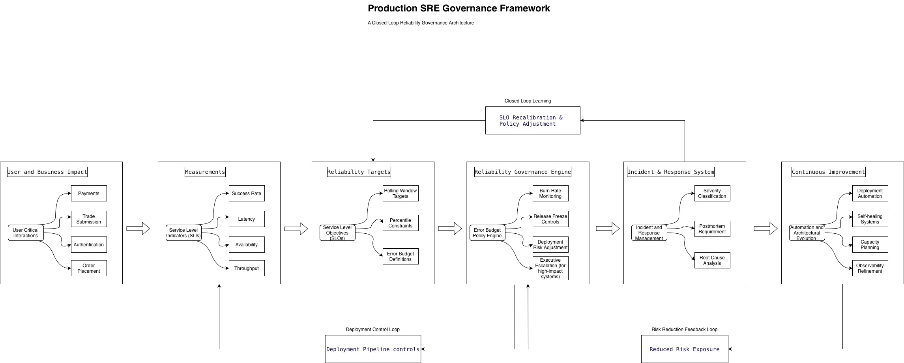

# Production SRE Governance Framework (PSGF)

## Overview

The Production SRE Governance Framework (PSGF) defines a structured,
closed-loop approach to designing, measuring, and governing reliability
in production systems.

It treats reliability not as monitoring,
but as a policy-driven engineering discipline.

---

## Architecture

---

## Core Concepts

### 1. User-Centric Reliability
Reliability is defined by successful completion of user-critical actions,
not infrastructure health metrics.

---

### 2. Structured SLO Design (URO Model)
SLOs are derived using the User → Risk → Objective methodology:
- User-critical interaction identification
- Risk quantification
- Objective definition
- Error budget allocation
- Feedback integration

---

### 3. Reliability Governance Engine
Error budgets act as control signals that govern:
- Deployment velocity
- Release approvals
- Incident prioritization
- Engineering focus

---

### 4. Closed-Loop Feedback System

The framework implements three feedback loops:

- **Learning Loop**: Incident → SLO recalibration
- **Control Loop**: Governance → Deployment pipeline
- **Risk Reduction Loop**: Automation → Reduced failure probability

---

### 5. Automation-Driven Stability
Automation reduces operational risk through:
- Deployment pipelines
- Self-healing systems
- Observability improvements
- Capacity planning

---

## Repository Structure

docs/
├── framework-overview.md
├── day1-sre-principles.md
├── slo-design-guide.md
├── reliability-governance-model.md

---

## Applicability

PSGF is designed for:

- High-availability distributed systems
- Financial and regulated environments
- Latency-sensitive services
- Transaction-heavy platforms

---

## Version

**v1.0 — Initial Release**

This version establishes:
- Core principles
- SLO design methodology
- Reliability governance model
- Closed-loop architecture

---

## Author

Atul Raj Menon  
Site Reliability / Observability Engineer

---

## License

MIT License
